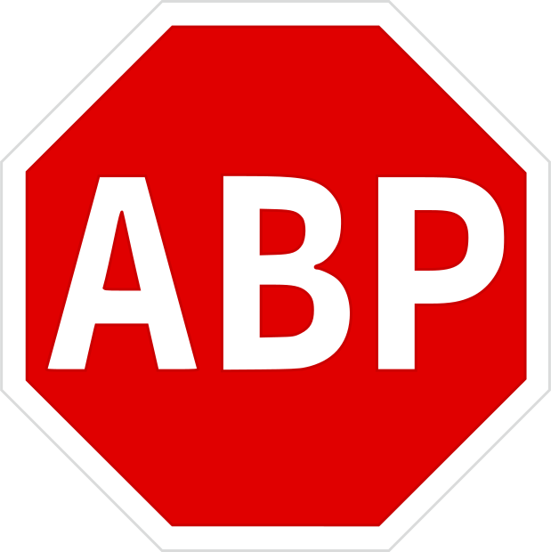

# Amazing Adblockers ![GitHub Issues or Pull Requests][GitHub Issues or Pull Requests] ![GitHub License][Github License] ![GitHub Repo stars][GitHub Repo stars]
Look and compare the each of adblocker in current year!

## Why we need this?
Currently, there are many of ad blockers in our time and we can't decide, which ad blocker efficient, which not.
If you don't want to decide which is the best, just take and use **[uBlock Origin](https://github.com/gorhill/uBlock)**[^1] with **[recommended filterlists](https://github.com/yokoffing/filterlists)**.
[^1]: For **Google Chrome** users which not using `ExtensionManifestV2Availability`[^2] policy, use **[uBlock Origin Lite](https://github.com/uBlockOrigin/uBOL-home)**
[^2]: `ExtensionManifestV2Availability` policy is for **Google Chrome Enterprise** *(can be also enabled for regular google chrome)* which extends period of Manifest V2 usage.

## List of ad blockers

| Ad blocker                                                                                                           | Link                                                      |
|----------------------------------------------------------------------------------------------------------------------|-----------------------------------------------------------|
|   uBlock Origin             | **[uBlock Origin & Lite](docs/ublockOriginNLite.md)**     |
|  AdGuard AdBlocker                                                   | **[AdGuard AdBlocker](docs/adGuard.md)**                  |
|  AdBlock                                                        | **[AdBlock](docs/adBlock.md)**                            |
|  Adblock Plus                                         | **[Adblock Plus](docs/adBlockPlus.md)**                   |

## Contribution
If you want to contribute to this project, look into **[CONTRIBUTING.md](dosc/CONTRIBUTING.md)**.
I would appreciate your help and contribution to this project!

## Credits
- All developers & contributors to these ad blockers which worked hard for making browsing experience more faster and easier
- All contributors to this project, without them - it wouldn't be easy to keep information up to date!

<!----------------------------------[ Badges ]--------------------------------->

[GitHub Issues or Pull Requests]: https://img.shields.io/github/issues/techplayz32/Amazing-Adblockers
[GitHub License]: https://img.shields.io/github/license/techplayz32/Amazing-Adblockers
[GitHub Repo stars]: https://img.shields.io/github/stars/techplayz32/Amazing-Adblockers
